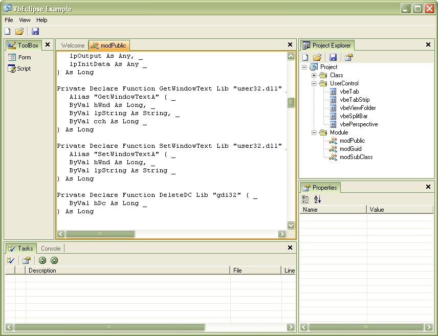



## VbEclipse \(Preview Version 0\.2\.36 \- Last Update: 12/24/2004\)

### Description

Perspectives like Eclipse. Comments welcome ;)

NOTE: This is just a preview.

Features:

* Multiple Perspectives

* Drag & Drop Support

* DoubleClick to expand/restore tabs

* Tabbed views

* Windows XP Themes

Latest version is available at: http://www.pscode.com/vb/scripts/ShowCode.asp?txtCodeId=58587&lngWId=1
 
### More Info
 

             |
---                |---
**Submitted On**   |2004-12-24 18:38:54
**By**             |[AB\-Software](https://github.com/Planet-Source-Code/PSCIndex/blob/master/ByAuthor/ab-software.md)
**Level**          |Advanced
**User Rating**    |4.8 (58 globes from 12 users)
**Compatibility**  |VB 6\.0
**Category**       |[Custom Controls/ Forms/  Menus](https://github.com/Planet-Source-Code/PSCIndex/blob/master/ByCategory/custom-controls-forms-menus__1-4.md)
**World**          |[Visual Basic](https://github.com/Planet-Source-Code/PSCIndex/blob/master/ByWorld/visual-basic.md)
**Archive File**   |[VbEclipse\_18330012242004\.zip](https://github.com/Planet-Source-Code/ab-software-vbeclipse-preview-version-0-2-36-last-update-12-24-2004__1-57741/archive/master.zip)

